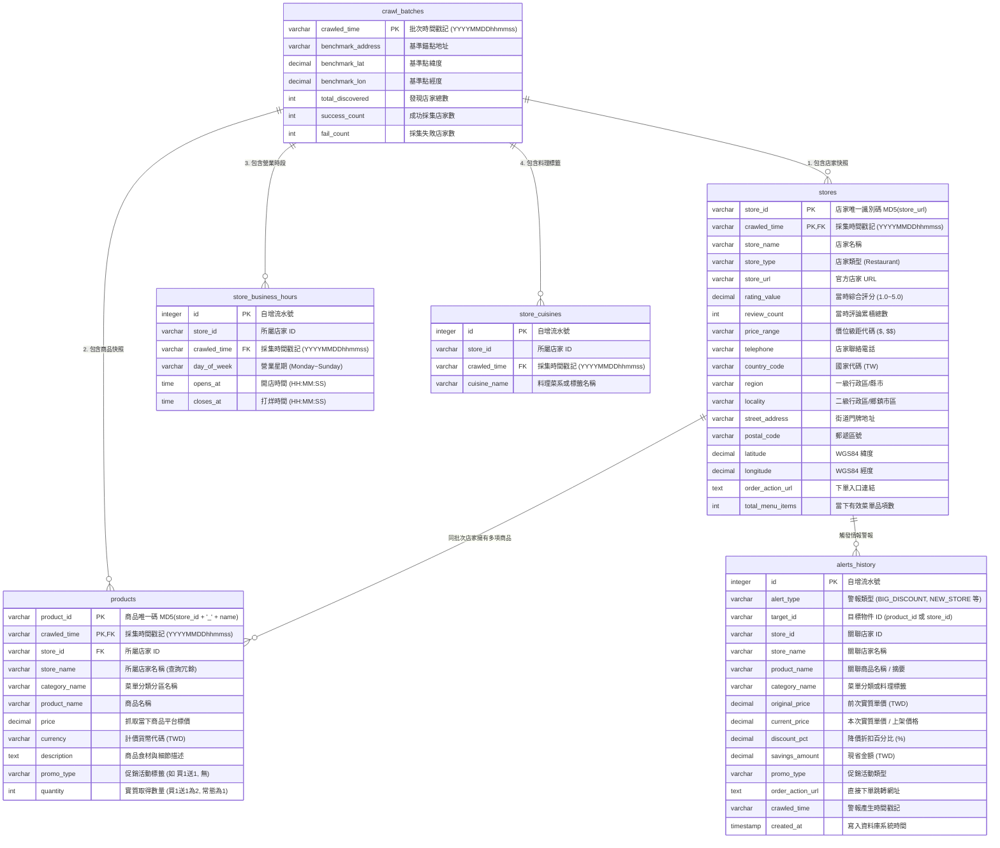

# 外送平台價格與商品監控系統 (Uber Eats Monitor)
# 資料庫元資料與資料字典規格書 (Database Metadata & Data Dictionary)

> **資料庫檔案名稱**：`ubereats_monitor.db`  
> **資料庫引擎**：SQLite 3 (啟用 `WAL` 模式與 `PRAGMA foreign_keys = ON;`)  
> **核心設計架構**：以全域統一時間戳記（**`crawled_time`** = `YYYYMMDDhhmmss`）驅動之不可變時序快照架構 (Immutable Time-Series Snapshots)  
> **文件版本**：v2.0 (包含 6 大實體資料表、完整欄位定義與商業情報指標)

---

## 目錄 (Table of Contents)
1. [資料庫整體架構與核心設計準則](#1-資料庫整體架構與核心設計準則)
2. [實體關聯圖 (ER Diagram)](#2-實體關聯圖-er-diagram)
3. [各資料表與欄位變數詳細說明 (Data Dictionary)](#3-各資料表與欄位變數詳細說明-data-dictionary)
   - 3.1 [`crawl_batches` (採集批次總表)](#31-crawl_batches-採集批次總表)
   - 3.2 [`stores` (店家資料時序快照表)](#32-stores-店家資料時序快照表)
   - 3.3 [`products` (商品與價格時序快照表)](#33-products-商品與價格時序快照表)
   - 3.4 [`store_business_hours` (店家營業時間表)](#34-store_business_hours-店家營業時間表)
   - 3.5 [`store_cuisines` (店家料理菜系標籤表)](#35-store_cuisines-店家料理菜系標籤表)
   - 3.6 [`alerts_history` (智慧差異情報與特價/新品歷史表)](#36-alerts_history-智慧差異情報與特價新品歷史表)
4. [索引結構與查詢效能優化 (Indexes)](#4-索引結構與查詢效能優化-indexes)
5. [衍生指標與核心計算邏輯 (Derived Metrics & Logic)](#5-衍生指標與核心計算邏輯-derived-metrics--logic)
6. [精選時序商業分析 SQL 範例 (Analytics Queries)](#6-精選時序商業分析-sql-範例-analytics-queries)

---

## 1. 資料庫整體架構與核心設計準則

本系統之資料庫 `ubereats_monitor.db` 用於儲存外送平台（Uber Eats）在不同時間點抓取之店家基本資訊、評分、營業時間、菜單結構、商品標價以及智慧差異情報。

### 1.1 核心設計原則
1. **全域統一時間戳 (`crawled_time`)**：
   - 全資料庫所有實體資料表皆具有 **`crawled_time`** 欄位。
   - 格式統一為 **14 碼字串 `YYYYMMDDhhmmss`**（例如 `20260825161056`），精確對齊爬蟲任務與原始 JSON 檔案前綴。
   - 廢除雜亂時間格式（如 `updated_at`, `scraped_at`），全系統歷史回溯與時序 JOIN 均以 `crawled_time` 為唯一對齊基準。
2. **複合主鍵 (Composite Primary Key)**：
   - 核心時序表（`stores`, `products`）採用 `(實體ID, crawled_time)` 作為複合主鍵，天然具備不可變時序快照特性。
3. **外鍵約束與級聯刪除 (Cascading Integrity)**：
   - 所有次級表均以 `crawled_time` 建立外鍵參照 `crawl_batches(crawled_time)`，並設定 `ON DELETE CASCADE`，確保批次資料生命週期一致性。
4. **雜湊唯一性識別碼 (MD5 Deterministic IDs)**：
   - 店家 ID (`store_id`)：由官方 URL 計算 MD5，跨批次保持恆定。
   - 商品 ID (`product_id`)：由 `MD5(store_id + "_" + product_name)` 計算，精確錨定同一店家下的同名商品，實現跨日調價追蹤。

---

## 2. 實體關聯圖 (ER Diagram)



---

## 3. 各資料表與欄位變數詳細說明 (Data Dictionary)

### 3.1 `crawl_batches` (採集批次總表)
記錄每一次排程採集任務之全域元資料（Metadata）、基準定位點及爬蟲執行成果統計。

| 變數名稱 (Column Name) | 資料型別 (Type) | 鍵約束 (Key) | 空值限制 (Null) | 預設值 (Default) | 變數業務定義與詳細說明 | 範例數值 (Example) |
| :--- | :--- | :---: | :---: | :---: | :--- | :--- |
| **`crawled_time`** | `VARCHAR(14)` | **PK** | **NOT NULL** | - | **採集批次時間戳記**。格式嚴格為 14 碼西元年月日時分秒（`YYYYMMDDhhmmss`），為所有表關聯之主根鍵。 | `'20260825161056'` |
| `benchmark_address` | `VARCHAR(255)`| - | **NOT NULL** | - | **採集基準地址**。爬蟲以此地址作為地理中心探索周邊可外送店家。 | `'台北市士林區中山北路七段81巷'` |
| `benchmark_lat` | `DECIMAL(10, 7)`| - | **NOT NULL** | - | 基準錨點之 **WGS84 緯度座標**。 | `25.1220568` |
| `benchmark_lon` | `DECIMAL(10, 7)`| - | **NOT NULL** | - | 基準錨點之 **WGS84 經度座標**。 | `121.5298302` |
| `total_discovered` | `INT` | - | **NOT NULL** | `0` | 該次任務於周邊區域**探索發現的總店家數**。 | `526` |
| `success_count` | `INT` | - | **NOT NULL** | `0` | 該次任務**成功解析並完整寫入**菜單與店家資料的店家總數。 | `480` |
| `fail_count` | `INT` | - | **NOT NULL** | `0` | 該次任務擷取失敗、超時或頁面結構異常的店家數。 | `46` |

---

### 3.2 `stores` (店家資料時序快照表)
記錄每一間店家在特定採集時間點之基本營運資訊、聯絡方式、評分口碑與地理門牌位置。

| 變數名稱 (Column Name) | 資料型別 (Type) | 鍵約束 (Key) | 空值限制 (Null) | 預設值 (Default) | 變數業務定義與詳細說明 | 範例數值 (Example) |
| :--- | :--- | :---: | :---: | :---: | :--- | :--- |
| **`store_id`** | `VARCHAR(32)` | **PK (1/2)** | **NOT NULL** | - | **店家唯一識別碼**。由店家 Uber Eats 官方專頁 URL 經 MD5 雜湊計算而成（32 碼小寫十六進位字串），保證跨批次識別穩定。 | `'8a4a2efb373c5010538fd3f027ca291e'` |
| **`crawled_time`** | `VARCHAR(14)` | **PK (2/2) / FK** | **NOT NULL** | - | **快照採集時間戳記**。參照 `crawl_batches(crawled_time)`，表明此筆店家資料的採集時間點。 | `'20260825161056'` |
| `store_name` | `VARCHAR(255)`| - | **NOT NULL** | - | **店家完整營業名稱**（已進行 HTML Entity 解碼與空白標準化）。 | `'瑞記海南雞飯 天母店'` |
| `store_type` | `VARCHAR(50)` | - | **NOT NULL** | `'Restaurant'`| 店家商業型態（符合 Schema.org，如 `Restaurant`, `GroceryStore`）。 | `'Restaurant'` |
| `store_url` | `VARCHAR(1000)`| - | **NOT NULL** | - | Uber Eats 平台官方店家專頁完整網址。 | `'https://www.ubereats.com/tw/store/.../eOb6kKenRBS177m79Lzvwg'` |
| `rating_value` | `DECIMAL(3, 2)`| - | NULL | `None` | 採集當下顧客**綜合星等評分**（範圍 `1.00` ~ `5.00`，新店或無評分時為 NULL）。 | `4.80` |
| `review_count` | `INT` | - | NULL | `None` | 採集當下店家累積之**顧客評論與評價總數**（無評價時為 NULL）。 | `10000` |
| `price_range` | `VARCHAR(10)` | - | NULL | `None` | 外送平台標示之**價位等級代碼**（如 `$`, `$$`, `$$$`）。 | `'$$'` |
| `telephone` | `VARCHAR(50)` | - | NULL | `None` | 店家公開聯絡電話（含國際碼格式）。 | `'+886228720292'` |
| `country_code` | `VARCHAR(10)` | - | NULL | `'TW'` | 國家或地區 ISO 代碼（預設為台灣 `TW`）。 | `'TW'` |
| `region` | `VARCHAR(50)` | - | NULL | `None` | 一級行政區/縣市直轄市。 | `'台北市'` |
| `locality` | `VARCHAR(50)` | - | NULL | `None` | 二級行政區/鄉鎮市區。 | `'士林區'` |
| `street_address` | `VARCHAR(255)`| - | NULL | `None` | 實體門市之街道巷弄與門牌地址。 | `'中山北路七段15號'` |
| `postal_code` | `VARCHAR(20)` | - | NULL | `None` | 郵遞區號。 | `'111'` |
| `latitude` | `DECIMAL(10, 7)`| - | NULL | `None` | 店家實體門市之 **WGS84 緯度座標**。 | `25.1190395` |
| `longitude` | `DECIMAL(10, 7)`| - | NULL | `None` | 店家實體門市之 **WGS84 經度座標**。 | `121.5303496` |
| `order_action_url`| `TEXT` | - | NULL | `None` | 帶有官方導購活動參數（UTM Campaign）的直接點餐下單網址。 | `'https://www.ubereats.com/...utm_campaign=order-action'` |
| `total_menu_items`| `INT` | - | **NOT NULL** | `0` | 採集當下該店家**有效上架之菜單商品總品項數**。 | `42` |

---

### 3.3 `products` (商品與價格時序快照表)
記錄每一道菜品/商品在特定時間點的分類歸屬、名稱、平台標價、促銷活動與數量結構，為價格波動分析之核心基石。

| 變數名稱 (Column Name) | 資料型別 (Type) | 鍵約束 (Key) | 空值限制 (Null) | 預設值 (Default) | 變數業務定義與詳細說明 | 範例數值 (Example) |
| :--- | :--- | :---: | :---: | :---: | :--- | :--- |
| **`product_id`** | `VARCHAR(32)` | **PK (1/2)** | **NOT NULL** | - | **商品唯一識別碼**。計算公式為 `MD5(store_id + "_" + product_name)`（32 碼小寫十六進位字串），確保同店家同品名商品在跨時序比對時具備穩定唯一性。 | `'cfa170c3ebb5a987375f3463375e0409'` |
| **`crawled_time`** | `VARCHAR(14)` | **PK (2/2) / FK** | **NOT NULL** | - | **快照採集時間戳記**。參照 `crawl_batches(crawled_time)`，表明此筆價格與商品資訊的抓取時間點。 | `'20260825161056'` |
| `store_id` | `VARCHAR(32)` | **FK** | **NOT NULL** | - | 所屬店家之唯一識別碼（對應 `stores.store_id`）。 | `'8a4a2efb373c5010538fd3f027ca291e'` |
| `store_name` | `VARCHAR(255)`| - | **NOT NULL** | - | **所屬店家名稱**（冗餘設計，便於直接在單表進行關鍵字檢索與統計，大幅降低跨表 JOIN 負載）。 | `'瑞記海南雞飯 天母店'` |
| `category_name` | `VARCHAR(100)`| - | NULL | `None` | 菜單分類/分區名稱（如「人氣精選」、「主餐」、「單點小菜」；去重時優先保留具體菜系分類）。 | `'熱門主食'` |
| `product_name` | `VARCHAR(255)`| - | **NOT NULL** | - | **商品完整品名**。 | `'海南雞腿飯'` |
| `price` | `DECIMAL(10, 2)`| - | **NOT NULL** | - | **平台標示價格**（新台幣 TWD）。排除價格 <= 0 之非商品宣傳與公告項目。 | `229.00` |
| `currency` | `VARCHAR(10)` | - | **NOT NULL** | `'TWD'` | 計價貨幣 ISO 代碼（預設為新台幣 `TWD`）。 | `'TWD'` |
| `description` | `TEXT` | - | NULL | `None` | 商品食材用料、口感、份量、口味選擇或客製化說明文字。 | `'嚴選去骨雞腿肉，搭配當日鮮蔬與自製醬料'` |
| `promo_type` | `VARCHAR(50)` | - | **NOT NULL** | `'無'` | **促銷活動類型**。由 NLP 正則規則由品名/分類/描述自動提取（如：`買1送1`, `買2送1`, `買2送2`, `無`）。 | `'買1送1'` |
| `quantity` | `INT` | - | **NOT NULL** | `1` | **該價格可實質獲得之商品份數**。常態為 `1`；若為 `買1送1` 則為 `2`；`買2送1` 則為 `3`。用於計算實質單件單價 (`price / quantity`)。 | `2` |

---

### 3.4 `store_business_hours` (店家營業時間表)
記錄店家在各星期的各個營業與打烊時段快照。

| 變數名稱 (Column Name) | 資料型別 (Type) | 鍵約束 (Key) | 空值限制 (Null) | 預設值 (Default) | 變數業務定義與詳細說明 | 範例數值 (Example) |
| :--- | :--- | :---: | :---: | :---: | :--- | :--- |
| **`id`** | `INTEGER` | **PK** | **NOT NULL** | (自增) | 自動遞增之唯一流水號主鍵。 | `7673` |
| `store_id` | `VARCHAR(32)` | **FK** | **NOT NULL** | - | 所屬店家之唯一識別碼（對應 `stores.store_id`）。 | `'8a4a2efb373c5010538fd3f027ca291e'` |
| `crawled_time` | `VARCHAR(14)` | **FK** | **NOT NULL** | - | 快照採集時間戳記，參照 `crawl_batches(crawled_time)`。 | `'20260825161056'` |
| `day_of_week` | `VARCHAR(20)` | - | **NOT NULL** | - | **營業日星期名稱**（英文標準值：`Monday`, `Tuesday`, `Wednesday`, `Thursday`, `Friday`, `Saturday`, `Sunday`）。 | `'Monday'` |
| `opens_at` | `TIME` | - | **NOT NULL** | - | 該時段之**開店營業時間**（格式標準化為 `HH:MM:SS`）。 | `'11:00:00'` |
| `closes_at` | `TIME` | - | **NOT NULL** | - | 該時段之**打烊結束時間**（格式標準化為 `HH:MM:SS`）。 | `'21:30:00'` |

---

### 3.5 `store_cuisines` (店家料理菜系標籤表)
記錄店家被外送平台所標註之料理分類、菜系特色與風味標籤快照。

| 變數名稱 (Column Name) | 資料型別 (Type) | 鍵約束 (Key) | 空值限制 (Null) | 預設值 (Default) | 變數業務定義與詳細說明 | 範例數值 (Example) |
| :--- | :--- | :---: | :---: | :---: | :--- | :--- |
| **`id`** | `INTEGER` | **PK** | **NOT NULL** | (自增) | 自動遞增之唯一流水號主鍵。 | `3001` |
| `store_id` | `VARCHAR(32)` | **FK** | **NOT NULL** | - | 所屬店家之唯一識別碼（對應 `stores.store_id`）。 | `'8a4a2efb373c5010538fd3f027ca291e'` |
| `crawled_time` | `VARCHAR(14)` | **FK** | **NOT NULL** | - | 快照採集時間戳記，參照 `crawl_batches(crawled_time)`。 | `'20260825161056'` |
| `cuisine_name` | `VARCHAR(100)`| - | **NOT NULL** | - | **料理分類或特色標籤名稱**。 | `'新加坡美食'` |

---

### 3.6 `alerts_history` (智慧差異情報與特價/新品歷史表)
由智慧差異情報引擎（`alert_engine.py`）自動分析比對前後批次後生成之特價、新開店、新品上架與買一送一情報紀錄，支援防重複推播與儀表板展示。

| 變數名稱 (Column Name) | 資料型別 (Type) | 鍵約束 (Key) | 空值限制 (Null) | 預設值 (Default) | 變數業務定義與詳細說明 | 範例數值 (Example) |
| :--- | :--- | :---: | :---: | :---: | :--- | :--- |
| **`id`** | `INTEGER` | **PK** | **NOT NULL** | (自增) | 自動遞增之唯一流水號主鍵。 | `18` |
| `alert_type` | `VARCHAR(20)` | - | **NOT NULL** | - | **情報警報類型**代碼：<br>• `BIG_DISCOUNT`：降幅 >= 30% 且現省 >= $20 之大特價商品<br>• `NEW_STORE`：歷史首度出現之全新進駐店家<br>• `NEW_PRODUCT`：既有老店新推出的全新菜品<br>• `PROMO_BOGO`：買1送1或多件折扣促銷專區 | `'BIG_DISCOUNT'` |
| `target_id` | `VARCHAR(64)` | - | **NOT NULL** | - | **警報目標唯一識別碼**。商品情報為 `product_id`；店家情報為 `store_id`。與 `alert_type` 和 `crawled_time` 組成唯一約束 `UNIQUE(alert_type, target_id, crawled_time)` 防止重複產生。 | `'fd5cf49712fa5881853e2e1a575023e6'` |
| `store_id` | `VARCHAR(32)` | - | **NOT NULL** | - | 關聯店家唯一 ID。 | `'8cbebcccd6915457cf360122ae34fcc6'` |
| `store_name` | `VARCHAR(255)`| - | **NOT NULL** | - | 關聯店家名稱。 | `"Chili's 天母店"` |
| `product_name` | `VARCHAR(255)`| - | NULL | `None` | 關聯商品名稱（新店家時為摘要文字，如「【全新進駐】共 45 道菜品」）。 | `'酥炸花枝 Fried Calamari'` |
| `category_name` | `VARCHAR(100)`| - | NULL | `None` | 菜單分類名稱或店家料理標籤。 | `'開胃菜 Appetizers'` |
| `original_price` | `DECIMAL(10, 2)`| - | NULL | `None` | **前次實質單價**（前批次之 `price / quantity`，新上架商品為 NULL）。 | `633.00` |
| `current_price` | `DECIMAL(10, 2)`| - | NULL | `None` | **本次實質單價**（本次批次之 `price / quantity`，新店家為 NULL）。 | `380.00` |
| `discount_pct` | `DECIMAL(5, 2)`| - | NULL | `None` | **降價折扣百分比**（計算公式：`((original - current) / original) * 100`，單位 `%`）。 | `40.00` |
| `savings_amount` | `DECIMAL(10, 2)`| - | NULL | `None` | **實質現省金額**（計算公式：`original_price - current_price`，單位 TWD）。 | `253.00` |
| `promo_type` | `VARCHAR(50)` | - | NULL | `'無'` | 促銷標籤（如 `'買1送1'`, `'新店家'`, `'無'`）。 | `'無'` |
| `order_action_url`| `TEXT` | - | NULL | `None` | 外送平台直接點餐下單 URL。 | `'https://www.ubereats.com/tw/store/...'` |
| `crawled_time` | `VARCHAR(14)` | - | **NOT NULL** | - | 該情報產生所依據之最新採集時間戳記 (`YYYYMMDDhhmmss`)。 | `'20260825161056'` |
| `created_at` | `TIMESTAMP` | - | **NOT NULL** | `CURRENT_TIMESTAMP` | 該情報寫入資料庫之系統時間。 | `'2026-08-25 09:43:44'` |

---

## 4. 索引結構與查詢效能優化 (Indexes)

為了確保在數十萬筆巨量時序資料中，跨日價格比對、降價排行與店家歷史回溯能在毫秒（Millisecond）級別完成，資料庫建立了以下關鍵索引：

| 索引名稱 (Index Name) | 所屬資料表 (Table) | 索引欄位 (Indexed Columns) | 類型 (Type) | 最佳化查詢場景與用途 |
| :--- | :--- | :--- | :---: | :--- |
| `sqlite_autoindex_crawl_batches_1` | `crawl_batches` | `crawled_time` | UNIQUE (PK) | 批次時間戳唯一性與主鍵查詢。 |
| `sqlite_autoindex_stores_1` | `stores` | `store_id, crawled_time` | UNIQUE (PK) | 店家時序快照複合主鍵檢索。 |
| `sqlite_autoindex_products_1` | `products` | `product_id, crawled_time` | UNIQUE (PK) | 商品時序快照複合主鍵檢索與去重。 |
| **`idx_products_history`** | `products` | `product_id, crawled_time DESC` | INDEX | **單一商品跨時間價格走勢查詢**（支援圖表時間軸回溯）。 |
| **`idx_products_store_time`** | `products` | `store_id, crawled_time DESC` | INDEX | **特定店家最新或歷史完整菜單快照查詢**。 |
| **`idx_stores_history`** | `stores` | `store_id, crawled_time DESC` | INDEX | **店家評分、評論數與營運狀態歷史變遷查詢**。 |
| **`idx_hours_unique`** | `store_business_hours`| `store_id, crawled_time, day_of_week, opens_at, closes_at` | UNIQUE INDEX | 防止同一採集批次重複寫入相同營業時段。 |
| `idx_hours_store_time` | `store_business_hours`| `store_id, crawled_time` | INDEX | 快速撈取特定店家在某時間點之營業時段。 |
| **`idx_cuisines_unique`** | `store_cuisines` | `store_id, crawled_time, cuisine_name` | UNIQUE INDEX | 防止同一採集批次重複寫入相同料理標籤。 |
| `idx_cuisines_store_time` | `store_cuisines` | `store_id, crawled_time` | INDEX | 快速撈取特定店家之菜系分類標籤。 |
| **`idx_alerts_time`** | `alerts_history` | `crawled_time DESC, alert_type` | INDEX | **最新情報警報推播與分類篩選**（儀表板首頁快速載入）。 |
| **`idx_alerts_discount`** | `alerts_history` | `discount_pct DESC` | INDEX | **大特價降幅排行榜查詢**。 |
| `idx_alerts_store` | `alerts_history` | `store_id, crawled_time` | INDEX | 查詢特定店家之歷史特價與促銷活動紀錄。 |

---

## 5. 衍生指標與核心計算邏輯 (Derived Metrics & Logic)

### 5.1 實質單件單價 (Effective Unit Price)
外送平台上常出現「買1送1」、「買2送1」等活動，若僅比對表面標價會失真。系統引進實質單價機制：
$$\text{實質單價 (Effective Unit Price)} = \frac{\text{平台標價 (price)}}{\text{實質獲得數量 (quantity)}}$$
- **常態商品**：標價 \$200，`quantity = 1` $\rightarrow$ 實質單價 = \$200。
- **買 1 送 1**：標價 \$200，`quantity = 2` $\rightarrow$ 實質單價 = \$100。

### 5.2 大特價 (Big Discount) 判定標準
當前次批次（$T_{prev}$）與本次批次（$T_{curr}$）比對時，滿足以下條件即觸發 `BIG_DISCOUNT` 警報：
1. **降價幅度 (Discount Percentage)**：
   $$\text{discount\_pct} = \frac{\text{prev\_eff\_price} - \text{curr\_eff\_price}}{\text{prev\_eff\_price}} \times 100\% \ge 30.0\%$$
2. **現省金額 (Savings Amount)**：
   $$\text{savings\_amount} = \text{prev\_eff\_price} - \text{curr\_eff\_price} \ge \$20.0\text{ 元}$$

### 5.3 全新進駐店家 (New Store) 判定標準
$$\text{store\_id} \in \text{Stores}(T_{curr}) \quad \text{AND} \quad \text{store\_id} \notin \text{Stores}(T < T_{curr})$$

### 5.4 老店新上架菜色 (New Product) 判定標準
$$\text{product\_id} \in \text{Products}(T_{curr}) \quad \text{AND} \quad \text{product\_id} \notin \text{Products}(T < T_{curr}) \quad \text{AND} \quad \text{store\_id} \in \text{Stores}(T < T_{curr})$$

---

## 6. 精選時序商業分析 SQL 範例 (Analytics Queries)

### 6.1 查詢特定商品（如「海南雞腿飯」）歷史價格波動趨勢
```sql
SELECT 
    store_name AS 店家名稱,
    product_name AS 商品名稱,
    price AS 平台標價,
    promo_type AS 促銷活動,
    quantity AS 數量,
    ROUND(price * 1.0 / quantity, 2) AS 實質單價,
    currency AS 幣別,
    crawled_time AS 抓取時間戳記
FROM products
WHERE product_name LIKE '%海南雞腿飯%'
ORDER BY store_name, product_name, crawled_time DESC;
```

### 6.2 跨日調價偵測：比較 2026-08-24 與 2026-08-25 價格變動明細
```sql
SELECT 
    p_curr.store_name AS 店家名稱,
    p_curr.product_name AS 商品名稱,
    ROUND(p_prev.price * 1.0 / p_prev.quantity, 2) AS [前次實質單價],
    ROUND(p_curr.price * 1.0 / p_curr.quantity, 2) AS [本次實質單價],
    ROUND((p_curr.price * 1.0 / p_curr.quantity) - (p_prev.price * 1.0 / p_prev.quantity), 2) AS 價差,
    ROUND((((p_curr.price * 1.0 / p_curr.quantity) - (p_prev.price * 1.0 / p_prev.quantity)) 
          / (p_prev.price * 1.0 / p_prev.quantity)) * 100.0, 2) AS 漲跌幅百分比,
    p_prev.crawled_time AS 前次時間,
    p_curr.crawled_time AS 本次時間
FROM products p_curr
JOIN products p_prev 
  ON p_curr.product_id = p_prev.product_id
WHERE p_prev.crawled_time = '20260824161056'
  AND p_curr.crawled_time = '20260825161056'
  AND (p_curr.price * 1.0 / p_curr.quantity) != (p_prev.price * 1.0 / p_prev.quantity)
ORDER BY 價差 ASC;
```

### 6.3 查詢最新一批次所有「買 1 送 1 / 買幾送幾」超值促銷清單
```sql
SELECT 
    store_name AS 店家名稱,
    category_name AS 分類名稱,
    product_name AS 商品名稱,
    promo_type AS 促銷類型,
    price AS 平台標價,
    quantity AS 取得份數,
    ROUND(price * 1.0 / quantity, 2) AS 實質單價,
    crawled_time AS 採集時間
FROM products
WHERE promo_type != '無' 
  AND price > 0
  AND crawled_time = (SELECT MAX(crawled_time) FROM crawl_batches)
ORDER BY (price * 1.0 / quantity) ASC;
```

### 6.4 查詢店家評分與評論數隨時間變化歷史
```sql
SELECT 
    store_name AS 店家名稱,
    crawled_time AS 採集時間,
    rating_value AS 星等評分,
    review_count AS 評論總數,
    total_menu_items AS 菜單品項數
FROM stores
WHERE store_name LIKE '%鼎泰豐%' OR store_name LIKE '%雙月食品社%'
ORDER BY store_name, crawled_time ASC;
```
