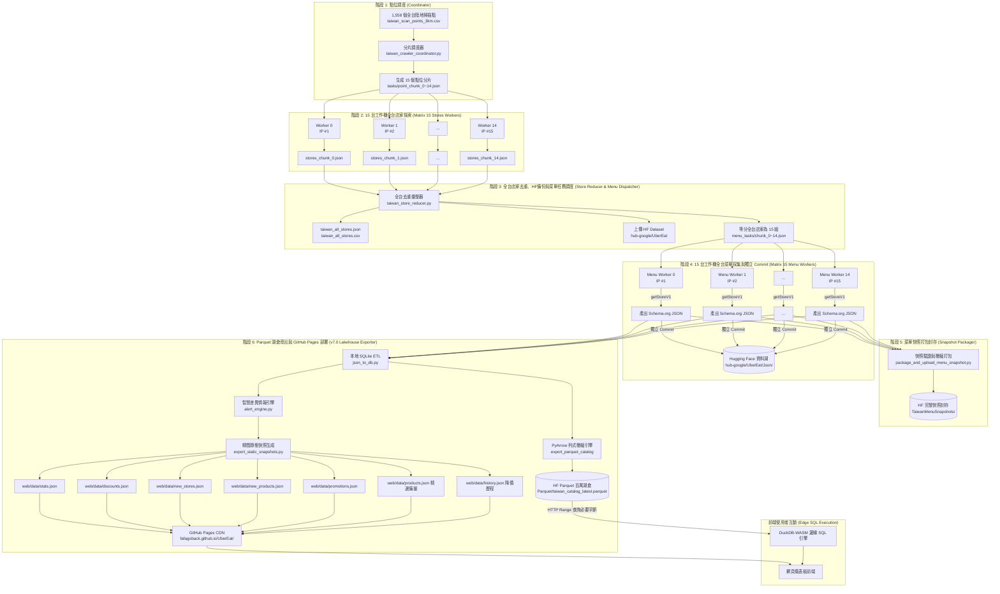

# 外送平台全台店家與菜單分散式採集系統 系統需求規格書 (SRS)
## (Taiwan Uber Eats 15-Worker Distributed Stores & Menu Scraping Pipeline SRS)

> **專案名稱**：Uber Eats 全台大規模店家與菜單分散式自動採集暨情報監控系統  
> **目標 Hugging Face Repo**：[`hub-google/UberEat`](https://huggingface.co/datasets/hub-google/UberEat)  
> **發布端點與 CDN**：GitHub Pages 邊緣靜態快照 ＋ Hugging Face Parquet 資料湖  
> **架構版本**：`v7.0` (全台 15 台工作機探索 ➔ 全域去重 ➔ 15 台菜單採集 ➔ HF 湖倉封存 ➔ Parquet 列式壓縮直傳 ➔ DuckDB-WASM 邊緣 SQL 檢索 ＋ GitHub Pages 發布)  
> **狀態**：正式設計定稿 (Production Big Data Lakehouse & Edge SQL Architecture)  
> **更新時間**：2026-08-27  

---

## 1. 系統願景與核心架構轉型概述

本系統旨在建立一套**全自動化、具備高度容錯、零維護成本、完全免費（$0 費用）、支援數十 GB 歷史數據規模與全台百萬商品即時檢索的「全台灣外送平台店家與菜單資料湖採集暨即時情報系統」**。

### 核心架構升級 (v6.0 ➔ v7.0 現代大數據湖倉)：
* **舊架構痛點 (v6.0)**：在 GHA 導出單一巨大的 `products.json`（1.7GB）與 `history.json`（476MB），導致執行 `git push` 時撞上 GitHub 官方 100MB 單檔防護限制，且瀏覽器端載入 1.7GB JSON 會直接耗盡記憶體崩潰。
* **新架構突破 (v7.0 Lakehouse + DuckDB-WASM)**：
  1. **100% 完全免費且支援數十 GB 歷史資料**：利用 Hugging Face Datasets 提供無容量上限的免費 LFS 大數據存儲（$0 成本），徹底解決長期累積數十 GB 爬蟲數據的儲存痛點。
  2. **Parquet 列式壓縮 (40~60MB)**：GHA 在本地將全台 200 萬件商品壓縮為高效列式 Parquet 檔案，並自動直傳 Hugging Face Datasets（`Parquet/taiwan_catalog_latest.parquet`）。
  3. **DuckDB-WASM 邊緣 SQL 毫秒級檢索**：前端瀏覽器直接運行 WebAssembly 版 DuckDB 引擎，透過 **HTTP Range Requests（按需字節分塊請求）**，使用者篩選「全台灣任意縣市、價格區間、牛肉麵/便當、評分」時，瀏覽器僅需下載數百 KB 字節，**0.03 秒（30ms）內即時渲染結果**。
  4. **GitHub Pages 安全部署保證**：前端儀表板精華資料（大盤指標、特價折扣、買一送一、新進店家）獨立導出為輕量 JSON（單檔 < 25MB），保證 CI/CD 與 GitHub Pages 部署 100% 成功。

---

## 2. 系統架構與流水線流程圖 (Pipeline Architecture)

系統採用標準的 **MapReduce 雙階段平行管線 ＋ Hugging Face Parquet 資料湖 ＋ DuckDB-WASM 邊緣檢索架構**：

---

## 3. 各階段詳細設計規格 (Stage-by-Stage Specifications)

### 3.1 階段 1：全台掃描點調度器 (Point Coordinator)
- **程式檔案**：`src/taiwan_crawler_coordinator.py`
- **輸入**：`taiwan_scan_points_3km_land_only.csv`（全台 1,558 陸地網格點）
- **行為**：
  1. 讀取 1,558 個經緯度錨點與所屬縣市。
  2. 採用 Round-Robin 均勻分配至 15 個分片。
  3. 產出 `tasks/point_chunk_0.json` ~ `tasks/point_chunk_14.json`。
  4. 輸出 GitHub Actions Dynamic Matrix JSON。

### 3.2 階段 2：15 台工作機全台店家探索 (Store Discovery Matrix Workers)
- **程式檔案**：`src/taiwan_store_worker.py`
- **執行環境**：15 台平行 Ubuntu Runner (`strategy.matrix: chunk_id: 0..14`)
- **行為**：
  1. 讀取分配之 `point_chunk_{id}.json`（每台約 104 個座標點）。
  2. 呼叫 `getFeedV1` 進行動態翻頁。
  3. 擷取店家欄位：`store_uuid`, `name`, `slug`, `store_url`, `store_lat`, `store_lon`, `rating_score`, `rating_count`, `rating_text`, `meta_tags`, `image_url`。
  4. 節點內初步去重，產出 `stores_chunk_{id}.json` 與 `stores_chunk_{id}.csv`。
  5. 上傳成果 Artifact (`store-chunk-result-{id}`)。

### 3.3 階段 3：全台店家去重、HF上傳與菜單任務調度 (Store Reducer & Menu Dispatcher)
- **程式檔案**：`src/taiwan_store_reducer.py`
- **輸入**：下載 15 台 Worker 的 `store-chunk-result-*`
- **行為**：
  1. **全域去重 (Global Deduplication)**：以 `store_uuid` 為唯一鍵，整併多點交叉觀測的店家資訊。
  2. **產出標準資料集**：
     - `taiwan_stores_dataset/taiwan_all_stores.json` (完整店家清單)
     - `taiwan_stores_dataset/taiwan_all_stores.csv` (UTF-8 BOM CSV)
     - `taiwan_stores_dataset/taiwan_summary.json` (統計分析摘要)
  3. **推送店家清單至 Hugging Face** (`TaiwanStores/`)。
  4. **生成 15 組菜單採集任務** (`menu_tasks/chunk_0.json` ~ `menu_tasks/chunk_14.json`)。

### 3.4 階段 4：15 台工作機全台菜單深度採集與獨立 Commit (Menu Scraper Matrix Workers)
- **程式檔案**：`src/taiwan_menu_worker.py`
- **執行環境**：15 台平行 Ubuntu Runner (`strategy.matrix: chunk_id: 0..14`)
- **行為**：
  1. 讀取 `menu_tasks/chunk_{id}.json`（每台約 1,600 ~ 2,300 間店家）。
  2. 透過 **原生 RPC `getStoreV1`** 逐店高速抓取完整商品、分類、價格、營業時間、滿額促銷標籤。
  3. 產出完全標準之 **Schema.org Restaurant JSON-LD** 格式檔案。
  4. 獨立 Commit 上傳 Hugging Face (`hub-google/UberEat/Json/`)，並上傳 GHA Artifact (`menu-result-chunk-{id}`)。

### 3.5 階段 5：菜單完整快照封存 (Snapshot Packager)
- **程式檔案**：`src/package_and_upload_menu_snapshot.py`
- **行為**：
  1. 驗證所有 Worker 檔案完整率。
  2. 打包成單一壓縮快照上傳 Hugging Face `TaiwanMenuSnapshots/`。

### 3.6 階段 6：Parquet 湖倉導出與 GitHub Pages 即時部署 (v7.0 Lakehouse Exporter)
- **程式檔案**：`src/export_static_snapshots.py`
- **行為**：
  1. 收集 15 台 Worker 的全部菜單 JSON 檔案，進行 Schema 嚴格校驗。
  2. 執行本地 SQLite ETL 清洗，建立商品、店家與行政區地理關聯。
  3. 啟動 `alert_engine.py` 計算過去 7 天價差（降幅 ≥ 20% 且現省 ≥ $20）、買一送一、新進店家、老店新菜。
  4. **Parquet 百萬湖倉生成**：透過 PyArrow 產出極致壓縮的 `taiwan_catalog.parquet`（全台 200 萬筆商品），自動直傳 Hugging Face Datasets（`Parquet/taiwan_catalog_latest.parquet` 與歷史歸檔目錄）。
  5. **輕量安全靜態快照**（保證單檔 < 25MB，符合 GitHub 政策）：
     - `stats.json`: 大盤指標總覽
     - `discounts.json`: 今日大特價清單
     - `new_stores.json`: 全新店家清單
     - `new_products.json`: 老店新品清單
     - `promotions.json`: 促銷優惠專區
     - `products.json`: 精選熱門商品清單 (4,000 筆離線備援)
     - `history.json`: 特價品價格歷史索引字典 (< 2MB)
     - `version.json`: 自動更新版本戳記
  6. 自動提交 Git 並直接發布至 GitHub Pages，實現最新資料即時上線。

---

## 4. 前端 DuckDB-WASM 與大數據查詢規範 (Frontend Architecture)

1. **靜態精華秒開 (`web/app.js`)**：
   - 儀表板四大分頁（今日特價、買一送一、新進店家、老店新品）直接讀取本地靜態 JSON，0ms 記憶體秒開。
2. **全台百萬商品邊緣檢索 (Tab 5)**：
   - 前端自動連線 Hugging Face Datasets 上的 `taiwan_catalog_latest.parquet`。
   - **DuckDB-WASM 邊緣運算**：支援使用者輸入全台 22 縣市下拉選單、價格區間、店家名稱、菜品關鍵字模糊搜尋、評分排序與分頁。
   - **HTTP Range Requests**：瀏覽器不下載整包檔案，僅按需抓取查詢字節，手機端亦能流暢運行。
   - **優雅降級（Graceful Fallback）**：離線或 Parquet 初始化期間，自動無縫使用 `products.json` 本地備援資料。

---

## 5. 效能評估與資源消耗試算 (Performance Benchmark)

| 階段 | 任務說明 | 運算節點數 | 預估處理數量 | 預估耗時 |
| :--- | :--- | :--- | :--- | :--- |
| **Stage 1** | 1,558 點位分片調度 | 1 台 | 1,558 網格點 | 約 2 ~ 3 秒 |
| **Stage 2** | 全台店家動態探索 | 15 台 (平行) | 每台約 104 點 (翻頁採集) | 約 3 ~ 5 分鐘 |
| **Stage 3** | 全台店家去重、上傳 HF、切分菜單任務 | 1 台 | ~30,000 間店家彙整 | 約 10 ~ 15 秒 |
| **Stage 4** | 全台菜單採集與獨立 Commit 上傳 HF | 15 台 (平行) | 每台約 1,600 ~ 2,000 間 (原生 RPC) | 約 8 ~ 12 分鐘 |
| **Stage 5** | 菜單快照打包與單次 Commit | 1 台 | 全台快照單檔封存 | 約 30 ~ 45 秒 |
| **Stage 6** | 本地 ETL、Parquet 導出直傳 HF & Pages 部署 | 1 台 | ~200 萬筆商品 Parquet 壓縮 ＋ 靜態化 | **約 15 ~ 25 秒** |
| **整體** | **全台灣全量店家 + 完整菜單端到端採集流水線** | **15 台並發** | **全台灣 100% 覆蓋** | **總計約 12 ~ 16 分鐘** |

---

## 6. 專案核心程式清單 (Architecture Components)

1. [`docs/系統需求書.md`](file:///c:/Users/ET/我的雲端硬碟/作品/UberEat/docs/系統需求書.md)：系統架構與需求規格書 (v7.0)。
2. [`src/export_static_snapshots.py`](file:///c:/Users/ET/我的雲端硬碟/作品/UberEat/src/export_static_snapshots.py)：Stage 6 Parquet 湖倉與靜態快照導出核心。
3. [`src/alert_engine.py`](file:///c:/Users/ET/我的雲端硬碟/作品/UberEat/src/alert_engine.py)：智慧差異情報與 7 天特價計算引擎。
4. [`src/json_to_db.py`](file:///c:/Users/ET/我的雲端硬碟/作品/UberEat/src/json_to_db.py)：本地高效 SQLite 關聯建庫模組。
5. [`web/config.js`](file:///c:/Users/ET/我的雲端硬碟/作品/UberEat/web/config.js)：前端大數據湖倉配置。
6. [`web/app.js`](file:///c:/Users/ET/我的雲端硬碟/作品/UberEat/web/app.js)：前端儀表板核心、DuckDB-WASM 邊緣 SQL 查詢與價格走勢圖模組。
7. [`web/index.html`](file:///c:/Users/ET/我的雲端硬碟/作品/UberEat/web/index.html)：支援全台縣市篩選與 DuckDB 湖倉狀態之響應式前端介面。
8. [`.github/workflows/taiwan_store_crawler.yml`](file:///c:/Users/ET/我的雲端硬碟/作品/UberEat/.github/workflows/taiwan_store_crawler.yml)：全台 15 工作機雙階段 MapReduce ＋ v7.0 湖倉發布流水線。

---
*本規格書正式成為外送平台全台採集與情報監控系統後續開發與維護之標準指引。*

