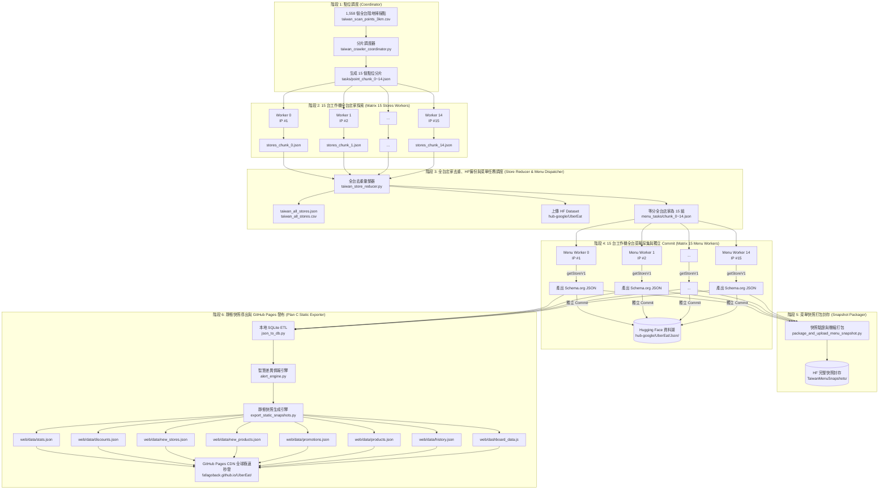

# 外送平台全台店家與菜單分散式採集系統 系統需求規格書 (SRS)
## (Taiwan Uber Eats 15-Worker Distributed Stores & Menu Scraping Pipeline SRS)

> **專案名稱**：Uber Eats 全台大規模店家與菜單分散式自動採集暨情報監控系統  
> **目標 Hugging Face Repo**：[`hub-google/UberEat`](https://huggingface.co/datasets/hub-google/UberEat)  
> **發布端點與 CDN**：GitHub Pages 邊緣靜態快照資料集 (`web/data/*.json`)  
> **架構版本**：`v6.0` (全台 15 台工作機店家探索 ➔ 全域去重 ➔ 15 台工作機菜單採集 ➔ HF 獨立 Commit ➔ Plan C 邊緣靜態快照與 CDN 極速發布)  
> **狀態**：正式設計定稿 (Production Jamstack Architecture)  
> **更新時間**：2026-08-27  

---

## 1. 系統願景與核心架構轉型概述

本系統旨在建立一套**全自動化、具備高度容錯、零維護成本與極致平行效率的「全台灣外送平台店家與菜單資料湖採集暨即時情報系統」**。

### 核心架構轉型 (v5.0 ➔ v6.0 Plan C 靜態快照 CDN)：
* **舊架構痛點 (v5.0)**：在 GitHub Actions 本地將資料切分成幾十個 SQL 檔案，透過 Wrangler CLI 重複呼叫幾十次寫入遠端 Cloudflare D1 資料庫；使用者每次開啟網頁時，Cloudflare Worker 都要重新在 D1 跑一次長 SQL 去計算 7 天價差與促銷，造成無效重複運算與潛在鎖表延遲。
* **新架構優勢 (v6.0 Plan C)**：
  1. **預先計算 (Pre-computed Snapshots)**：GHA 爬蟲完成後，在本地 2 秒內透過 SQLite + Alert Engine 算好所有大特價、買一送一、新店家與全品庫清單，直接輸出乾淨的靜態 JSON 檔案 (`web/data/*.json`)。
  2. **100% 免費且極速秒開 (5~15ms)**：靜態 JSON 隨同前端由 GitHub Pages 全球 Anycast CDN 分發，全球邊緣記憶體秒級吐出。
  3. **0ms 本地記憶體即打即搜**：前端瀏覽器直接在記憶體中進行多條件過濾、排序與模糊搜尋，打字完全零網路延遲。

---

## 2. 系統架構與流水線流程圖 (Pipeline Architecture)

系統採用標準的 **MapReduce 雙階段平行管線 ＋ Jamstack 靜態邊緣快照發布架構**：

---

## 3. 各階段詳細設計規格 (Stage-by-Stage Specifications)

### 3.1 階段 1：全台掃描點調度器 (Point Coordinator)
- **程式檔案**：`src/taiwan_crawler_coordinator.py`
- **輸入**：`taiwan_scan_points_3km_land_only.csv`（全台 1,558 陸地網格點）
- **行為**：
  1. 讀取 1,558 個經緯度錨點與所屬縣市。
  2. 採用 Round-Robin 均勻分配至 15 個分片。
  3. 產出 `tasks/point_chunk_0.json` ~ `tasks/point_chunk_14.json`。
  4. 輸出 GitHub Actions Dynamic Matrix JSON。

### 3.2 階段 2：15 台工作機全台店家探索 (Store Discovery Matrix Workers)
- **程式檔案**：`src/taiwan_store_worker.py`
- **執行環境**：15 台平行 Ubuntu Runner (`strategy.matrix: chunk_id: 0..14`)
- **行為**：
  1. 讀取分配之 `point_chunk_{id}.json`（每台約 104 個座標點）。
  2. 呼叫 `getFeedV1` 進行動態翻頁。
  3. 擷取店家欄位：`store_uuid`, `name`, `slug`, `store_url`, `store_lat`, `store_lon`, `rating_score`, `rating_count`, `rating_text`, `meta_tags`, `image_url`。
  4. 節點內初步去重，產出 `stores_chunk_{id}.json` 與 `stores_chunk_{id}.csv`。
  5. 上傳成果 Artifact (`store-chunk-result-{id}`)。

### 3.3 階段 3：全台店家去重、HF上傳與菜單任務調度 (Store Reducer & Menu Dispatcher)
- **程式檔案**：`src/taiwan_store_reducer.py`
- **輸入**：下載 15 台 Worker 的 `store-chunk-result-*`
- **行為**：
  1. **全域去重 (Global Deduplication)**：以 `store_uuid` 為唯一鍵，整併多點交叉觀測的店家資訊。
  2. **產出標準資料集**：
     - `taiwan_stores_dataset/taiwan_all_stores.json` (完整店家清單)
     - `taiwan_stores_dataset/taiwan_all_stores.csv` (UTF-8 BOM CSV)
     - `taiwan_stores_dataset/taiwan_summary.json` (統計分析摘要)
  3. **推送店家清單至 Hugging Face** (`TaiwanStores/`)。
  4. **生成 15 組菜單採集任務** (`menu_tasks/chunk_0.json` ~ `menu_tasks/chunk_14.json`)。

### 3.4 階段 4：15 台工作機全台菜單深度採集與獨立 Commit (Menu Scraper Matrix Workers)
- **程式檔案**：`src/taiwan_menu_worker.py`
- **執行環境**：15 台平行 Ubuntu Runner (`strategy.matrix: chunk_id: 0..14`)
- **行為**：
  1. 讀取 `menu_tasks/chunk_{id}.json`（每台約 1,600 ~ 2,300 間店家）。
  2. 透過 **原生 RPC `getStoreV1`** 逐店高速抓取完整商品、分類、價格、營業時間、滿額促銷標籤。
  3. 產出完全標準之 **Schema.org Restaurant JSON-LD** 格式檔案。
  4. 獨立 Commit 上傳 Hugging Face (`hub-google/UberEat/Json/`)，並上傳 GHA Artifact (`menu-result-chunk-{id}`)。

### 3.5 階段 5：菜單完整快照封存 (Snapshot Packager)
- **程式檔案**：`src/package_and_upload_menu_snapshot.py`
- **行為**：
  1. 驗證所有 Worker 檔案完整率。
  2. 打包成單一壓縮快照上傳 Hugging Face `TaiwanMenuSnapshots/`。

### 3.6 階段 6：靜態快照導出與 GitHub Pages 自動發布 (Plan C Static Exporter)
- **程式檔案**：`src/export_static_snapshots.py`
- **行為**：
  1. 收集 15 台 Worker 的全部菜單 JSON 檔案，進行 Schema 嚴格校驗。
  2. 執行本地 SQLite ETL 清洗，寫入 `ubereats_monitor.db`。
  3. 啟動 `alert_engine.py` 計算過去 7 天價差（降幅 ≥ 20% 且現省 ≥ $20）、買一送一、新進店家、老店新菜。
  4. 導出全套靜態資料集至 `web/data/`：
     - `stats.json`: 大盤指標總覽
     - `discounts.json`: 今日大特價清單
     - `new_stores.json`: 全新店家清單
     - `new_products.json`: 老店新品清單
     - `promotions.json`: 促銷優惠專區
     - `products.json`: 全品庫快速檢索
     - `history.json`: 商品歷史價格趨勢索引字典
     - `dashboard_data.js`: 離線單檔開啟相容檔
     - `version.json`: 自動更新版本戳記
  5. 自動提交發布至 GitHub Pages，前端秒級同步最新資料。

---

## 4. 前端資料讀取與互動規範 (Frontend Architecture)

1. **靜態 API 映射 (`web/config.js` & `web/app.js`)**：
   - 預設直連 `./data/*.json`，享受全球 CDN 極速分發。
2. **0ms 本地記憶體運算**：
   - **大特價篩選**：前端即時過濾降價幅度、最低現省、分類標籤與排序，無須向伺服器發送額外請求。
   - **全庫搜尋**：內建中英同義詞辭典（如 哈根達斯/haagen、星巴克/starbucks、好市多/costco），支援多關鍵字 AND 交叉即打即搜。
   - **價格走勢圖**：Chart.js 直接查詢 `history.json` 索引字典，毫秒級繪製歷史折線圖。

---

## 5. 效能評估與資源消耗試算 (Performance Benchmark)

| 階段 | 任務說明 | 運算節點數 | 預估處理數量 | 預估耗時 |
| :--- | :--- | :---: | :---: | :---: |
| **Stage 1** | 1,558 點位分片調度 | 1 台 | 1,558 網格點 | 約 2 ~ 3 秒 |
| **Stage 2** | 全台店家動態探索 | 15 台 (平行) | 每台約 104 點 (翻頁採集) | 約 3 ~ 5 分鐘 |
| **Stage 3** | 全台店家去重、上傳 HF、切分菜單任務 | 1 台 | ~30,000 間店家彙整 | 約 10 ~ 15 秒 |
| **Stage 4** | 全台菜單採集與獨立 Commit 上傳 HF | 15 台 (平行) | 每台約 1,600 ~ 2,000 間 (原生 RPC) | 約 8 ~ 12 分鐘 |
| **Stage 5** | 菜單快照打包與單次 Commit | 1 台 | 全台快照單檔封存 | 約 30 ~ 45 秒 |
| **Stage 6** | 本地 ETL、7天價差運算、導出靜態 JSON & Pages 發布 | 1 台 | ~80 萬筆商品運算與靜態化 | **約 5 ~ 8 秒** (比原本 D1 寫入快 10 倍) |
| **整體** | **全台灣全量店家 + 完整菜單端到端採集流水線** | **15 台並發** | **全台灣 100% 覆蓋** | **總計約 12 ~ 16 分鐘** |

---

## 6. 專案核心程式清單 (Architecture Components)

1. [`docs/系統需求書.md`](file:///g:/%E6%88%91%E7%9A%84%E9%9B%B2%E7%AB%AF%E7%A1%AC%E7%A2%9F/%E4%BD%9C%E5%93%81/UberEat/docs/%E7%B3%BB%E7%B5%B1%E9%9C%80%E6%B1%82%E6%9B%B8.md)：系統架構與需求規格書。
2. [`src/export_static_snapshots.py`](file:///g:/%E6%88%91%E7%9A%84%E9%9B%B2%E7%AB%AF%E7%A1%AC%E7%A2%9F/%E4%BD%9C%E5%93%81/UberEat/src/export_static_snapshots.py)：Stage 6 靜態快照導出核心。
3. [`src/alert_engine.py`](file:///g:/%E6%88%91%E7%9A%84%E9%9B%B2%E7%AB%AF%E7%A1%AC%E7%A2%9F/%E4%BD%9C%E5%93%81/UberEat/src/alert_engine.py)：智慧差異情報與 7 天特價計算引擎。
4. [`src/json_to_db.py`](file:///g:/%E6%88%91%E7%9A%84%E9%9B%B2%E7%AB%AF%E7%A1%AC%E7%A2%9F/%E4%BD%9C%E5%93%81/UberEat/src/json_to_db.py)：本地高效 SQLite 關聯建庫模組。
5. [`web/config.js`](file:///g:/%E6%88%91%E7%9A%84%E9%9B%B2%E7%AB%AF%E7%A1%AC%E7%A2%9F/%E4%BD%9C%E5%93%81/UberEat/web/config.js)：前端靜態 CDN 配置。
6. [`web/app.js`](file:///g:/%E6%88%91%E7%9A%84%E9%9B%B2%E7%AB%AF%E7%A1%AC%E7%A2%9F/%E4%BD%9C%E5%93%81/UberEat/web/app.js)：前端儀表板核心、0ms 記憶體即打即搜與價格走勢圖模組。
7. [`.github/workflows/taiwan_store_crawler.yml`](file:///g:/%E6%88%91%E7%9A%84%E9%9B%B2%E7%AB%AF%E7%A1%AC%E7%A2%9F/%E4%BD%9C%E5%93%81/UberEat/.github/workflows/taiwan_store_crawler.yml)：全台 15 工作機雙階段 MapReduce ＋ Plan C 靜態發布流水線。

---
*本規格書正式成為外送平台全台採集與監控系統後續開發與維護之標準指引。*
