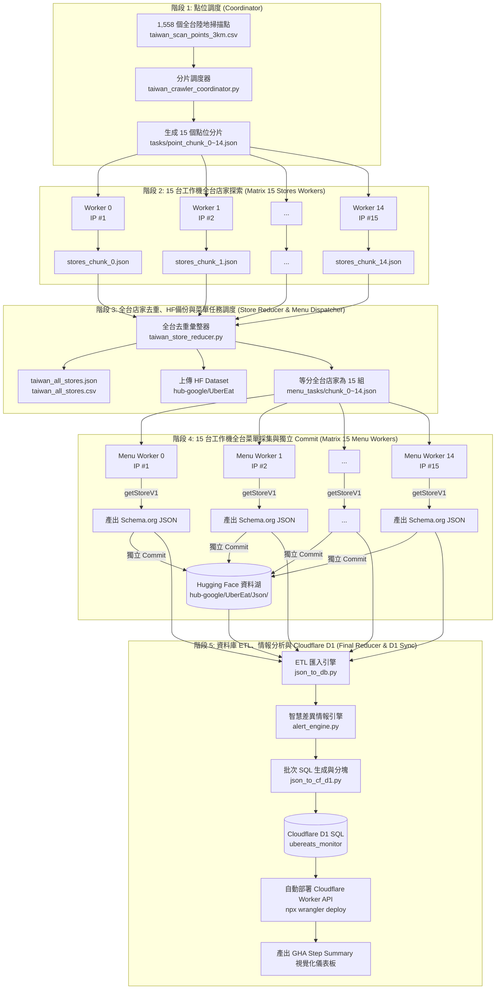

# 外送平台全台店家與菜單分散式採集系統 系統需求規格書 (SRS)
## (Taiwan Uber Eats 15-Worker Distributed Stores & Menu Scraping Pipeline SRS)

> **專案名稱**：Uber Eats 全台大規模店家與菜單分散式自動採集暨情報監控系統  
> **目標 Hugging Face Repo**：[`hub-google/UberEat`](https://huggingface.co/datasets/hub-google/UberEat)  
> **目標雲端資料庫**：Cloudflare D1 Serverless SQL (`ubereats_monitor`)  
> **版本**：`v5.0` (全台 15 台工作機店家探索 ➔ 全域去重 ➔ 15 台工作機菜單採集 ➔ HF 獨立 Commit ➔ Cloudflare D1 匯入)  
> **狀態**：正式設計定稿 (Production Architecture)  
> **建立時間**：2026-08-26  

---

## 1. 系統願景與核心需求概述

本系統旨在建立一套**全自動化、具備高度容錯與極致平行效率的「全台灣外送平台店家與菜單資料湖採集系統」**。

依據最新需求，系統需達成以下五大核心目標：
1. **全台 1,558 陸地網格覆蓋**：以 15 台 GitHub Actions 獨立工作機（擁有 15 個不同微軟雲端公網 IP），平行掃描全台 1,558 個 3km 經緯度基準點，探索全台所有上線店家。
2. **全台店家全局去重與資料湖存檔**：匯集 15 台探索成果，以 `store_uuid` 為唯一主鍵進行全台全局去重，並將全台店家資料集（JSON、CSV、統計摘要）推送到 Hugging Face Datasets（`hub-google/UberEat`）。
3. **動態等分 15 組菜單採集任務**：將去重後的全台店家清單（約 20,000 ~ 35,000 間）均勻切分為 15 等份，生成 15 個菜單抓取任務分片。
4. **15 台工作機平行抓取菜單並獨立 Commit 至 HF**：
   - 啟動 15 台菜單工作機，每台負責其分配到的店家子集。
   - 採用**官方原生 RPC API (`getStoreV1`)** 高速擷取完整菜單，產出完全相容 `location_batch_scraper.py` 的標準 **Schema.org Restaurant JSON-LD** 格式與統一命名規範。
   - 每個 Worker 完成後，**各自發動一次 Commit** 將其產出的菜單 JSON 檔案上傳至 Hugging Face `hub-google/UberEat` 的 `Json/` 目錄。
5. **資料庫 ETL、差異情報分析與 Cloudflare D1 同步**：所有 Worker 採集完畢後，發動終端彙整節點，執行本地 SQLite ETL、計算價格波動與促銷情報（Alert Engine），並批次同步至 Cloudflare D1 Serverless SQL 資料庫，最後部署最新版 Cloudflare Worker API。

---

## 2. 系統架構與流水線流程圖 (Pipeline Architecture)

系統採用標準的 **MapReduce 雙階段平行管線架構 (Two-Stage MapReduce Pipeline)**：



---

## 3. 技術可行性評估、潛在問題與解決方案 (Feasibility & Solutions)

針對使用者提出的架構，經深層技術審查，**整體架構完全可行且極具擴展性**，但需特別注意並解決以下 3 大關鍵技術挑戰：

### 3.1 挑戰一：15 台 Worker 同時向 Hugging Face 執行 Git Commit 的並行衝突 (Race Condition)
- **問題描述**：
  Hugging Face Datasets 採用 Git LFS / HTTP Commit API 機制。若 15 台工作機在接近的時間點同時發送 `upload_folder` 或 Commit 請求，極可能觸發 Git 遠端引用衝突（HTTP 409 Conflict 或 `non-fast-forward push rejected`）。
- **解決方案 (Resilience Strategy)**：
  1. **指數退避 + 隨機擾動重試 (Exponential Backoff with Random Jitter)**：
     在 Python 上傳模組 (`upload_to_hf.py`) 中加入智能重試邏輯（最多重試 5 次，每次隨機等待 $5 \sim 25$ 秒後重新取得遠端最新 HEAD 再執行 Commit）。
  2. **雙重容錯備份 (Artifact Fallback)**：
     每台 Worker 同時將 JSON 成果上傳至 GitHub Actions Artifact (`menu-chunk-result-X`)。若任一 Worker 遇到極端網路抖動，Stage 5 的最終 Reducer 可自動對漏缺檔案進行最後一次補推，確保 100% 不掉檔。

### 3.2 挑戰二：全台 3 萬間店家菜單資料量極大，Cloudflare D1 匯入限制
- **問題描述**：
  全台約 25,000 ~ 35,000 間店家，每間店家平均 30 道菜，單次抓取的商品記錄高達 **75 萬 ~ 100 萬筆**。
  若將全部 SQL 寫入單一高達 100MB 的 `.sql` 檔並透過 `wrangler d1 execute --file` 執行，會超過單次傳輸 Payload 限制或導致超時中斷。
- **解決方案 (SQL Chunking & Batching)**：
  1. **多列 INSERT 語句 (Multi-row INSERT)**：每 50 筆商品合併為單一 `INSERT OR REPLACE` 語句，將 SQL 語句數量壓縮 98%。
  2. **分塊 SQL 執行引擎 (Chunked SQL Execution)**：`json_to_cf_d1.py` 自動將大 SQL 切分為多個 10,000 筆的子檔案（如 `d1_sync_part_1.sql` ... `d1_sync_part_N.sql`），依序批次推送至 Cloudflare D1。

### 3.3 挑戰三：爬蟲頻率控制與反封鎖 (Anti-429 Rate Limiting)
- **問題描述**：
  大量並發請求可能觸發 Uber Eats 的 429 Too Many Requests。
- **解決方案**：
  1. **天然 15 IP 分流**：15 台 GitHub Actions Runner 各自具備微軟 Azure 資料中心的獨立公網出口 IP，流量被均勻分流至 15 個不同 IP。
  2. **原生 RPC API (`getStoreV1`)**：直連 Web 前端 RPC API，繞過傳統 HTML 網頁的 Bot Defense 與 Cloudflare 驗證碼挑戰。
  3. **自適應調步器 (Adaptive Rate Limiter)**：每台機器內部限制並發執行緒為 4~5，每次請求間隔 0.12 ~ 0.28 秒，遇 429 自動執行全域退避冷卻。

---

## 4. 各階段詳細設計規格 (Stage-by-Stage Specifications)

### 4.1 階段 1：全台掃描點調度器 (Point Coordinator)
- **程式檔案**：`scr/taiwan_crawler_coordinator.py`
- **輸入**：`taiwan_scan_points_3km_land_only.csv`（全台 1,559 陸地網格點）
- **行為**：
  1. 讀取 1,558 個經緯度錨點與所屬縣市。
  2. 採用 Round-Robin 輪流均勻分配至 15 個分片。
  3. 產出 `tasks/point_chunk_0.json` ~ `tasks/point_chunk_14.json`。
  4. 輸出 GitHub Actions Dynamic Matrix JSON。

### 4.2 階段 2：15 台工作機全台店家探索 (Store Discovery Matrix Workers)
- **程式檔案**：`scr/taiwan_store_worker.py`
- **執行環境**：15 台平行 Ubuntu Runner (`strategy.matrix: chunk_id: 0..14`)
- **行為**：
  1. 讀取分配之 `point_chunk_{id}.json`（每台約 104 個座標點）。
  2. 呼叫 `getFeedV1` 進行動態翻頁（預設最大翻頁 10 頁，可設定 0 無限見底）。
  3. 擷取店家欄位：`store_uuid`, `name`, `slug`, `store_url`, `store_lat`, `store_lon`, `rating_score`, `rating_count`, `rating_text`, `meta_tags`, `image_url`。
  4. 節點內初步去重，產出 `stores_chunk_{id}.json` 與 `stores_chunk_{id}.csv`。
  5. 上傳成果 Artifact (`store-chunk-result-{id}`)。

### 4.3 階段 3：全台店家全局去重、HF上傳與菜單任務調度 (Store Reducer & Menu Dispatcher)
- **程式檔案**：`scr/taiwan_store_reducer.py`
- **輸入**：下載 15 台 Worker 的 `store-chunk-result-*`
- **行為**：
  1. **全域去重 (Global Deduplication)**：以 `store_uuid` 為唯一鍵，整併多點交叉觀測的店家資訊，計算全台不重複店家總數與各縣市覆蓋率。
  2. **產出標準資料集**：
     - `taiwan_stores_dataset/taiwan_all_stores.json` (完整店家清單)
     - `taiwan_stores_dataset/taiwan_all_stores.csv` (UTF-8 BOM CSV)
     - `taiwan_stores_dataset/taiwan_summary.json` (統計分析摘要)
     - `taiwan_stores_dataset/taiwan_stores_by_county.json` (依縣市分組)
  3. **推送店家清單至 Hugging Face**：
     - 將 `taiwan_stores_dataset/` 上傳至 `hub-google/UberEat` 的 `TaiwanStores/` 目錄。
  4. **生成 15 組菜單採集任務 (Menu Chunks)**：
     - 將去重後的店家清單均分至 15 等份，產出 `menu_tasks/chunk_0.json` ~ `menu_tasks/chunk_14.json`。
     - 輸出 Stage 4 所需的 `menu_matrix` 與 Artifact (`menu-task-chunks`)。

### 4.4 階段 4：15 台工作機全台菜單深度採集與獨立 Commit (Menu Scraper Matrix Workers)
- **程式檔案**：`scr/taiwan_menu_worker.py` (基於 `location_batch_scraper.py` 4.0 核心)
- **執行環境**：15 台平行 Ubuntu Runner (`strategy.matrix: chunk_id: 0..14`)
- **行為**：
  1. 讀取 `menu_tasks/chunk_{id}.json`（每台約 1,600 ~ 2,300 間店家）。
  2. 透過 **原生 RPC `getStoreV1`** 逐店高速抓取完整商品、分類、價格、營業時間、滿額促銷標籤。
  3. 產出完全標準之 **Schema.org Restaurant JSON-LD** 格式檔案。
  4. **檔名與資料格式規範**：
     - 格式規範：與昨日 `location_batch_scraper.py` 完全相同之 JSON-LD。
     - 檔名規範：`{crawled_time}_{store_id_8碼}_{safe_name}.json`（例如 `20260826221500_a1b2c3d4_鼎泰豐_天母店.json`）。
  5. **獨立 Commit 上傳 Hugging Face**：
     - 調用 `upload_to_hf.py`（啟用 5 次指數退避重試），將產出的 JSON 資料夾推送到 `hub-google/UberEat` 的 `Json/` 目錄。
     - Commit 訊息範例：`Upload menu chunk 3 by Worker 3 (2150 stores)`。
  6. 同時上傳 GHA Artifact (`menu-result-chunk-{id}`) 留存。

### 4.5 階段 5：全局資料庫 ETL、差異情報分析與 Cloudflare D1 匯入 (Final Reducer & D1 Sync)
- **程式檔案**：`scr/json_to_cf_d1.py`, `scr/json_to_db.py`, `scr/alert_engine.py`
- **行為**：
  1. 收集彙整 15 台 Worker 的全部菜單 JSON 檔案。
  2. 執行本地 SQLite ETL 清洗，寫入 `ubereats_monitor.db` 之 6 大核心表（`crawl_batches`, `stores`, `products`, `store_business_hours`, `store_cuisines`, `alerts_history`）。
  3. 啟動 `alert_engine.py` 計算全台大特價品項、新上架商品、新加入店家、促銷買一送一。
  4. 產生分塊 D1 SQL 語句，透過 Wrangler 批次匯入 Cloudflare D1 Serverless SQL 資料庫。
  5. 執行 `npx wrangler deploy` 自動發布最新版 Cloudflare Worker API。
  6. 產出全台掃描成果大儀表板至 GitHub Actions `$GITHUB_STEP_SUMMARY`。

---

## 5. 資料格式標準與 Hugging Face 目錄結構規範

### 5.1 Hugging Face Repo 架構 (`hub-google/UberEat`)
```text
hub-google/UberEat/
├── .gitattributes
├── TaiwanStores/                          # 全台店家清單 (由 Stage 3 Reducer 維護)
│   ├── taiwan_all_stores.json             # 全台去重後所有店家完整清單
│   ├── taiwan_all_stores.csv              # Excel 相容 UTF-8 BOM CSV
│   ├── taiwan_stores_by_county.json       # 依縣市分組店家
│   └── taiwan_summary.json                # 全台掃描統計摘要
│
└── Json/                                  # 全台各店家菜單 Schema.org JSON 資料湖 (由 15 台 Menu Workers 共同維護)
    ├── 20260826221500_a1b2c3d4_麥當勞_台北館前店.json
    ├── 20260826221500_e5f6g7h8_鼎泰豐_信義店.json
    ├── 20260826221500_9a0b1c2d_迷客夏_板橋文化店.json
    └── ... (全台各店家時序 JSON 快照)
```

### 5.2 菜單 JSON 資料結構 (Schema.org Restaurant 標準格式)
```json
{
  "@context": "http://schema.org",
  "@type": "Restaurant",
  "@id": "https://www.ubereats.com/tw/store/mcdonalds-guanqian/a1b2c3d4-...",
  "name": "麥當勞 台北館前店",
  "isOpen": true,
  "telephone": "+886223812345",
  "workingHoursTagline": "上午 06:00 - 凌晨 02:00",
  "closedMessage": "",
  "hasStorePromotion": true,
  "address": {
    "@type": "PostalAddress",
    "streetAddress": "中正區館前路8號",
    "addressLocality": "中正區",
    "addressRegion": "台北市",
    "postalCode": "100",
    "addressCountry": "TW"
  },
  "geo": {
    "@type": "GeoCoordinates",
    "latitude": 25.0456,
    "longitude": 121.5158
  },
  "aggregateRating": {
    "@type": "AggregateRating",
    "ratingValue": 4.8,
    "reviewCount": 12500
  },
  "servesCuisine": ["美式", "速食", "漢堡"],
  "openingHoursSpecification": [
    {
      "@type": "OpeningHoursSpecification",
      "dayOfWeek": ["Monday", "Tuesday", "Wednesday", "Thursday", "Friday", "Saturday", "Sunday"],
      "opens": "06:00:00",
      "closes": "02:00:00"
    }
  ],
  "hasMenu": {
    "@type": "Menu",
    "hasMenuSection": [
      {
        "@type": "MenuSection",
        "name": "超值全餐",
        "hasMenuItem": [
          {
            "@type": "MenuItem",
            "name": "大麥克餐",
            "description": "經典大麥克漢堡 + 中薯 + 中杯冷飲",
            "offers": {
              "@type": "Offer",
              "price": "149.00",
              "priceCurrency": "TWD"
            }
          }
        ]
      }
    ]
  }
}
```

---

## 6. GitHub Actions Workflow 定義規劃 (`taiwan_store_crawler.yml`)

### 6.1 五大 Job 依賴關係
```yaml
name: Taiwan Uber Eats Stores & Menu Pipeline (15 Workers)

on:
  schedule:
    # 每天台灣時間 早上 06:30 與 晚上 18:30 (UTC 22:30 (前一日), 10:30) 自動執行全台大採集
    - cron: '30 22,10 * * *'
  workflow_dispatch:
    inputs:
      max_workers:
        description: '工作機台數 (預設 15 台)'
        required: false
        default: '15'
      max_pages_per_point:
        description: '單點店家探索最大翻頁數 (預設 10 頁，0為無限制)'
        required: false
        default: '10'

jobs:
  # Stage 1: 全台掃描點調度
  point_coordinator:
    runs-on: ubuntu-latest
    ...

  # Stage 2: 15 台工作機探索全台店家
  store_discovery_workers:
    needs: point_coordinator
    strategy:
      matrix: ${{ fromJson(needs.point_coordinator.outputs.matrix) }}
      max-parallel: 15
    ...

  # Stage 3: 全台店家去重、上傳 HF 店家清單、生成 15 組菜單任務
  store_reducer_and_menu_dispatcher:
    needs: [point_coordinator, store_discovery_workers]
    ...

  # Stage 4: 15 台工作機平行抓菜單並各 Commit 推送 HF
  menu_scraper_workers:
    needs: store_reducer_and_menu_dispatcher
    strategy:
      matrix: ${{ fromJson(needs.store_reducer_and_menu_dispatcher.outputs.menu_matrix) }}
      max-parallel: 15
    ...

  # Stage 5: 全局 ETL 匯入、差異情報分析與 Cloudflare D1 寫入
  db_etl_and_cloudflare_sync:
    needs: [store_reducer_and_menu_dispatcher, menu_scraper_workers]
    ...
```

---

## 7. 效能評估與資源消耗試算

| 階段 | 任務說明 | 運算節點數 | 預估處理數量 | 預估耗時 |
| :--- | :--- | :---: | :---: | :---: |
| **Stage 1** | 1,559 點位分片調度 | 1 台 | 1,559 網格點 | 約 2 ~ 3 秒 |
| **Stage 2** | 全台店家動態探索 | 15 台 (平行) | 每台約 104 點 (翻頁採集) | 約 3 ~ 5 分鐘 |
| **Stage 3** | 全台店家去重、上傳 HF、切分菜單任務 | 1 台 | ~30,000 間店家彙整 | 約 10 ~ 15 秒 |
| **Stage 4** | 全台菜單採集與獨立 Commit 上傳 HF | 15 台 (平行) | 每台約 1,600 ~ 2,000 間 (原生 RPC) | 約 8 ~ 12 分鐘 |
| **Stage 5** | 全台菜單 ETL、情報分析、Cloudflare D1 寫入 | 1 台 | ~80 萬筆商品 SQL 批次寫入 | 約 40 ~ 60 秒 |
| **整體** | **全台灣全量店家 + 完整菜單端到端採集流水線** | **15 台並發** | **全台灣 100% 覆蓋** | **總計約 12 ~ 18 分鐘** |

---

## 8. 專案待修改與新建檔案清單 (Implementation Checklist)

1. `系統需求書.md` (已建立，定義完整需求規格書)
2. `scr/taiwan_menu_worker.py` (新建：專門負責執行 Stage 4 菜單抓取，並在抓完後呼叫 `upload_to_hf.py` 獨立 Commit 上傳)
3. `scr/taiwan_store_reducer.py` (修改：擴充支援輸出 `menu_tasks/chunk_0~14.json`，並直接推送 `taiwan_stores_dataset` 至 HF)
4. `scr/upload_to_hf.py` (修改：強化指數退避與隨機擾動重試機制，防止 15 台並行 Commit 衝突)
5. `scr/json_to_cf_d1.py` (修改：支援全台 100 萬筆規模之 SQL 自動分塊寫入引擎)
6. `.github/workflows/taiwan_store_crawler.yml` (修改：升級為 5 階段端到端流水線)

---
*本規格書正式成為外送平台全台採集與監控系統後續開發與維護之標準指引。*
